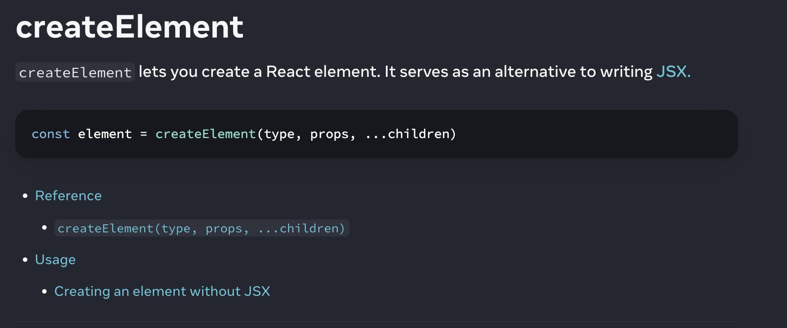

| Column 1 | Column 2                                                   |
|----------|------------------------------------------------------------|

## Episode 1 : 

### HTML , JS 
-Html
    html:5
    div , hello world 

- script tag - link js , css 
        document.createElement()
        document.write()
        document.getElementById().innerHTML
        document.getElementById().innerText
        document.getElementById().textContent
        document.appendChild()
-
-
-
-
-

### React 

React cdn
what is cdn 
what is crossirigin
What is crossorigin in script tag?
● What is CDN? Why do we use it?
Difference between a Library and Framework?

React 
reactDom
exported from those files
go through cdn links

#### how to create element using react 

const element = createElement(type, props, ...children)

type - valid React component type - html / React component / fragment 
props - className , props , 
children - nodes / string 

Examples : 
    -createElement(Greeting, { name: 'Taylor' });
    -createElement('div', { className: 'container' }, 'Hello World');
    -createElement('h1',{ className: 'greeting' },'Hello ', createElement('i', null, name),'. Welcome!' );

    rewritten as : 
    
    return (
    <h1 className="greeting">
      Hello <i>{name}</i>. Welcome!
    </h1>
  );

##### what is React element - its a javascript object 

React dom 

### Root / createRoot 

root = ReactDOM.createRoot(document.getElementById('root'));
root.render(element);

- this root is the place where everything happens inside React 
- the root element refers to the top-level element that is the parent of all other components in your application.

###### It is typically represented as a DOM node within the public/index.html file that serves as the entry point for your React app

###### createRoot(domNode, options?) 
## Call createRoot to create a React root for displaying content inside a browser DOM element.

## Returns 
createRoot returns an object with two methods: render and unmount.

import { createRoot } from 'react-dom/client';

const domNode = document.getElementById('root');
const root = createRoot(domNode);

# React will create a root for the domNode, and take over managing the DOM inside it. After you’ve created a root, you need to call root.render to display a React component inside of it:

root.render(<App />);

An app fully built with React will usually only have one createRoot call for its root component. A page that uses “sprinkles” of React for parts of the page may have as many separate roots as needed.

- clear all html inside root 
- reactNode:  JSX like <App /> /  a React element constructed with createElement(), a string, a number, null, or undefined.