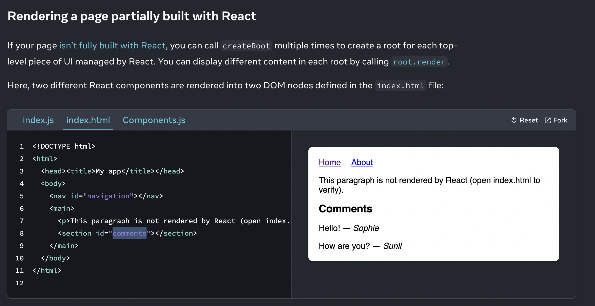
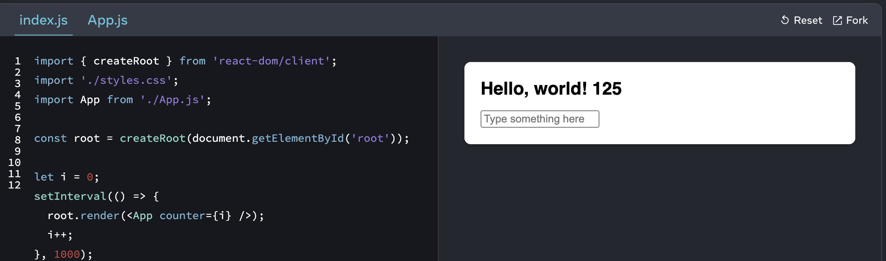

Library vs Framework 

React is a library it can be used indenpendently ( only for a section like form / Sidebar/ header)

Comments and Navigation are React components , rest are preserved 

Updating a root component 
You can call render more than once on the same root. As long as the component tree structure matches up with what was previously rendered, React will preserve the state

