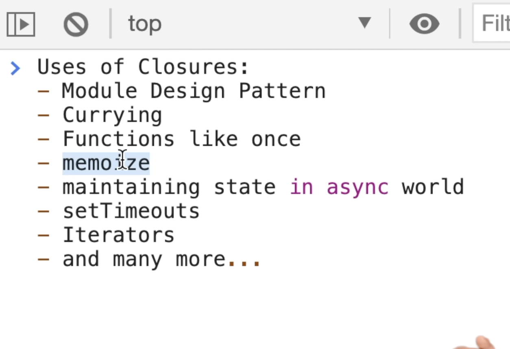

function + lexical scope = closure 

function  + along with its lexical scope = closure

reference to the outer scope variable is maintained even after the outer function has finished executing

its not garbage collected

function add(){
    var a = 10 ; 
    function y(){
        log(a);
    }
    a = 20;
    return y;
}

var z = add();
z(); // 20

shadowing - var a = 10; var a = 20; // 20

