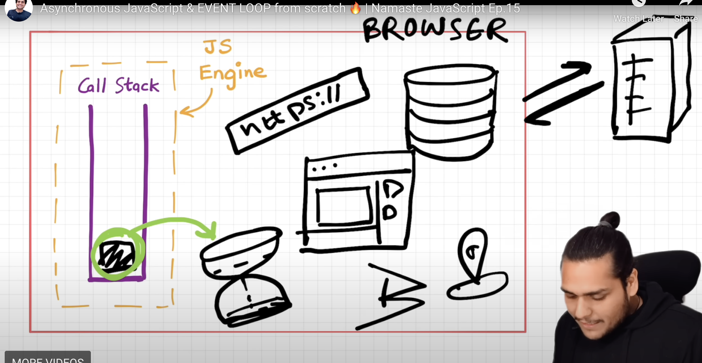
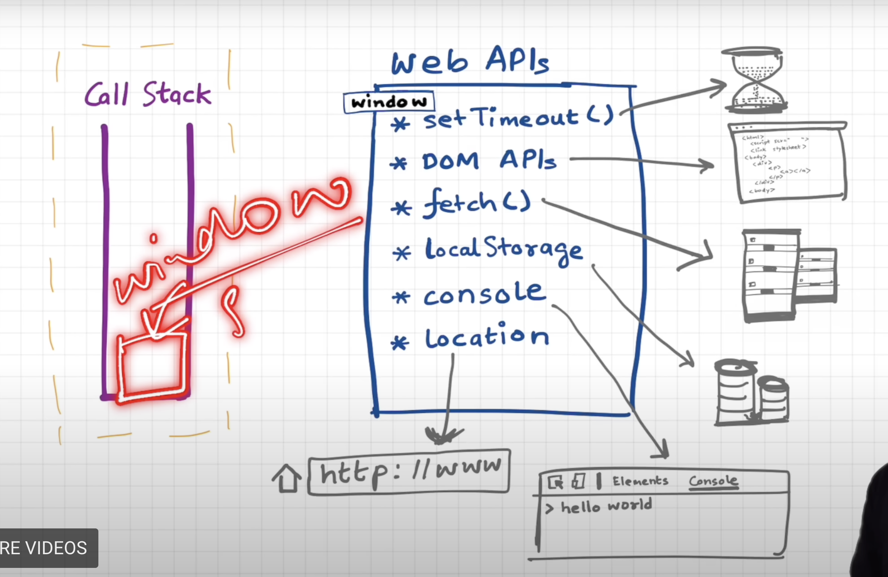
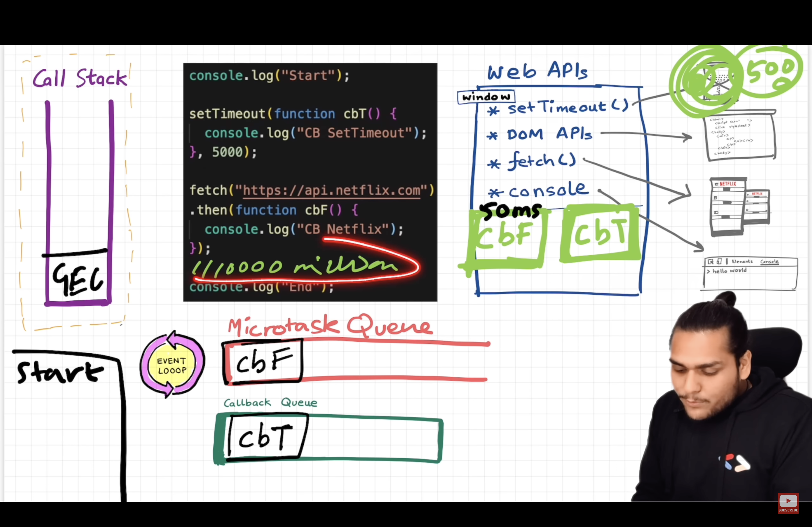
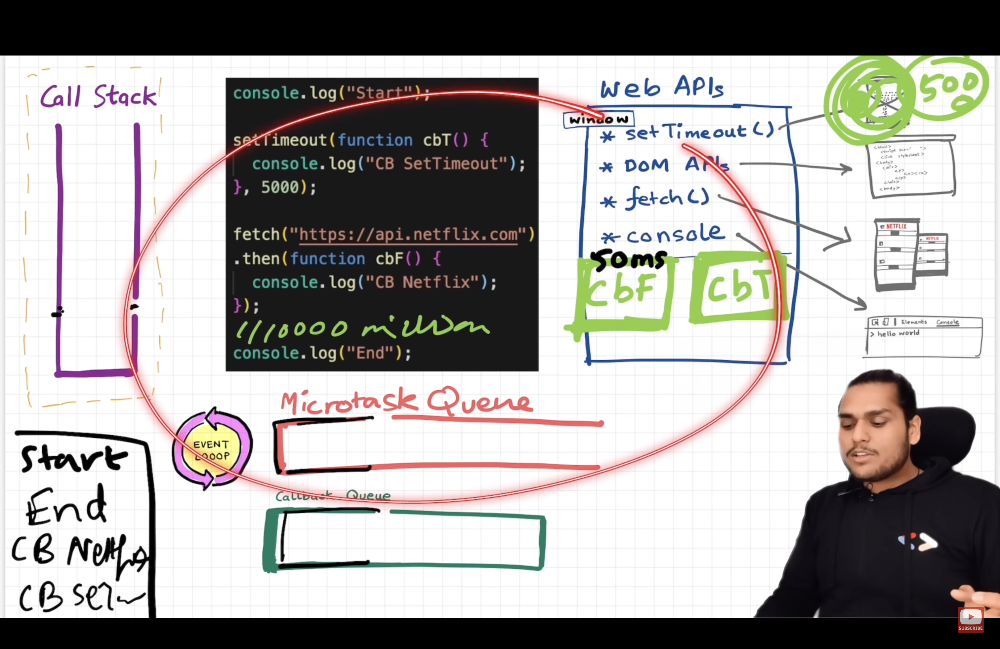

event loop 

callback queue

microtask queue

how everything in browser works

js - single threaded 
theres only one call stack
only one thing can happen at a time

when we run any js code - or when js is run / executed , GEC is created , pushed on the call stack
when a function is called , a new LEC is created , pushed on the call stack
when a function is returned , the LEC is popped off the call stack
in the end , the GEC is popped off the call stack

how async - 

through web apis - browser api - setTimeout , fetch , ajax , dom events

browser -has js engine, has timers , has url , has ability to connect to server , has to connect to bluetooth , location , camera etc 

js engineer - call stack - inside call stack - LECs are pushed and popped off - js is executed 

so how is all these super powers accessed - ?  - through web apis - its exported as window object 

when a web api is called - it is sent to the browser - the browser does the work - when the work is done - the callback is sent to the callback queue

inside web apis environment - callback is registered - means cb is stored , event type is attached to it 

this addEventListener - 
this doesnt go until - removeEventListener is called or browser is closed

when click event occurs - callback is put into callbck queue 

there is a event loop - which always keeps checking the call stack -

when the call stack is empty - the event loop checks the callback queue - if there is anything in the callback queue - it pushes it to the call stack

why do we even need callback queue - why not just push the callback to the call stack -

there are multiple events . callbacks attached to it , multiple times , but only single callstack - so we need to maintain a queue 

 because the call stack is single threaded - if we push the callback to the call stack - it will block the call stack - so we need a separate queue - so that the call stack is not blocked - so that the call stack can continue to execute other code - so that the call stack can be empty - so that the event loop can push the callback to the call stack

 

 

 Microtask queu - 

 what goes into the microtask queue - microtasks - promise callbacks , mutation observer callbacks , queueMicrotask

 when the call stack is empty - the event loop checks the microtask queue - if there is anything in the microtask queue - it pushes it to the call stack

 mutation observer - the program that keeps observing the dom - if there is any change in the dom - the callback is pushed to the microtask queue