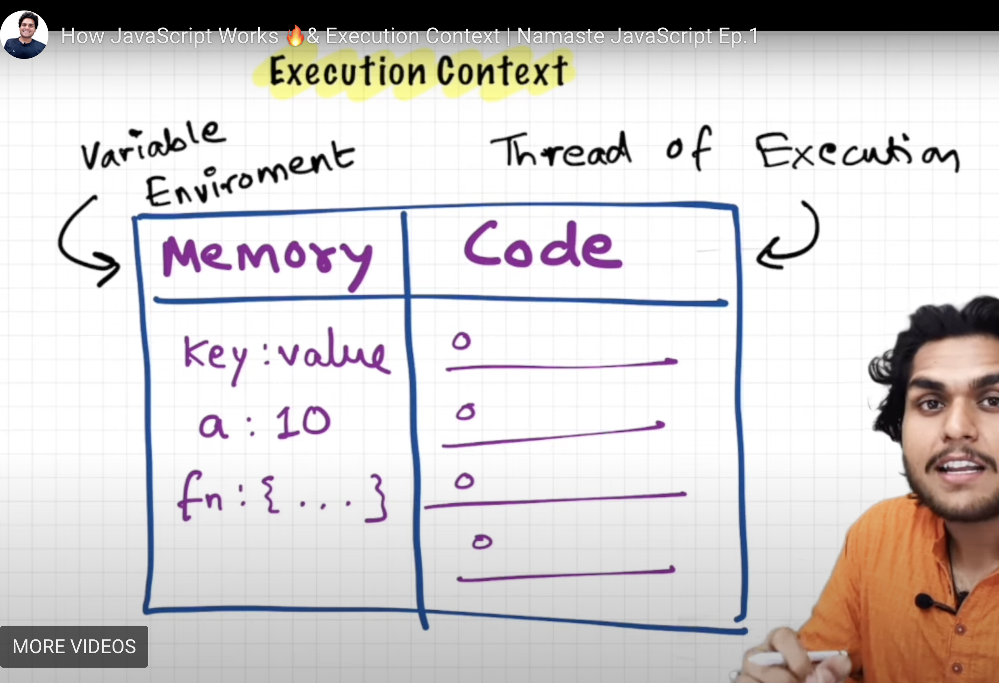
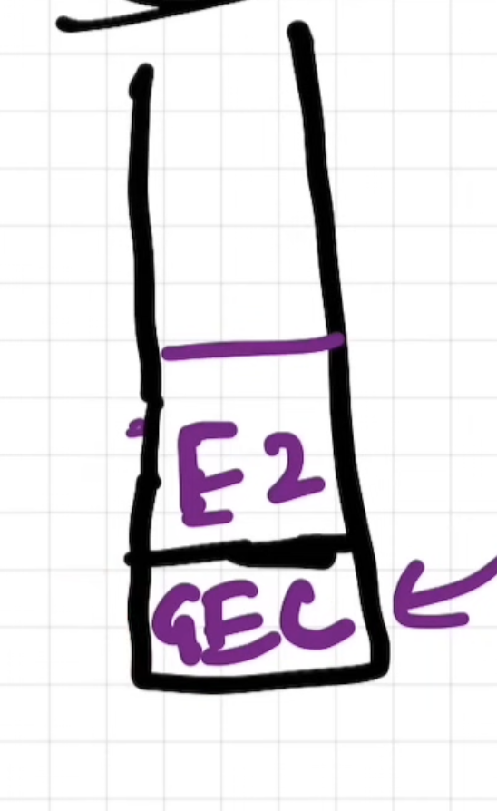
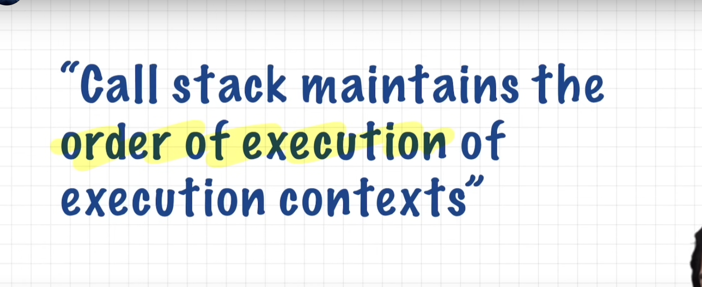
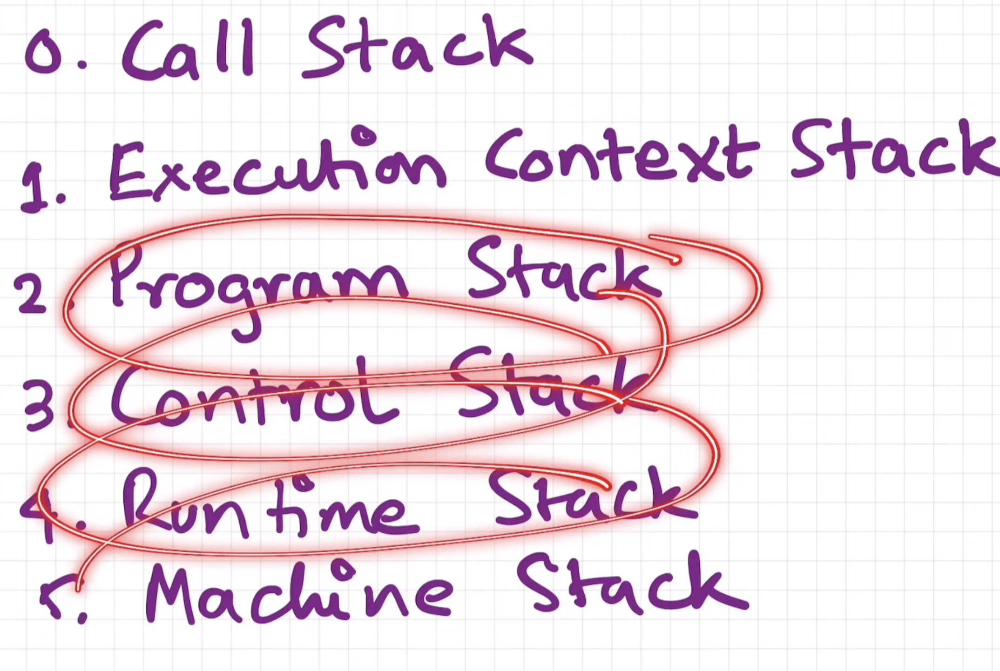
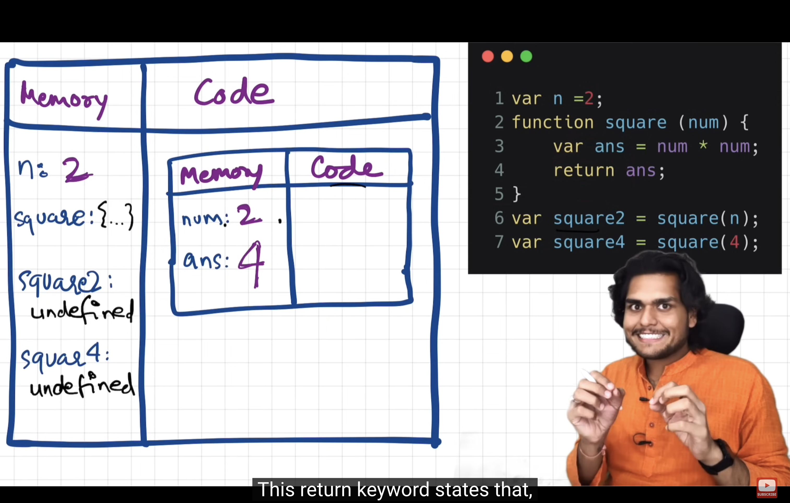
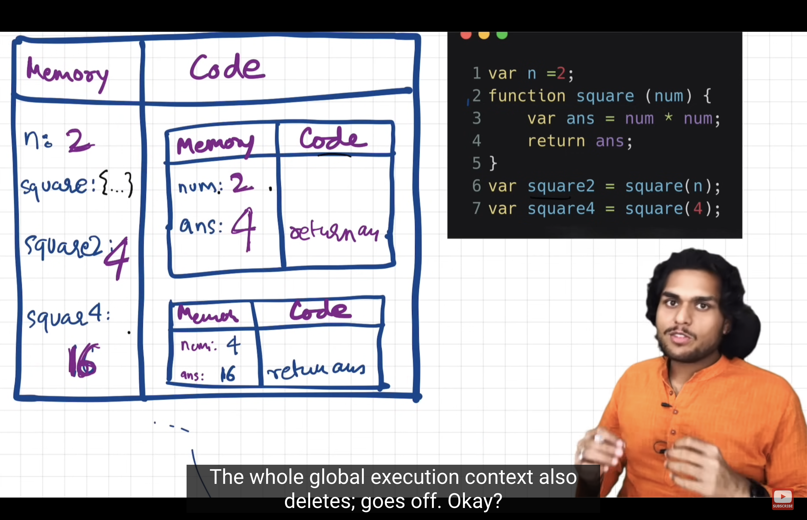

Everything in JS happnes inside execution context 

execution context - Memory component - Code component
Variables - Memory component   - key value - Varible Environment 

Code component - thread of Execution - Call stack 

JS - synchronous - single threaded 

----------------------------------------------------------------------------------------------------------------------------

What happens when u run a JS program 
- an global exec context is created 

MEmory - COde 

PHASE 1 ) MEMORY CREATION : Skims through the code -  creates space for variables and marks it undefined 
PHASE 2 ) CODE EXECUTION : Runs the code line by line - assigns values to variables

for every func new local exec context is created , repeats the above 2 phases

Call Stack : 

E1
E2
GEC 

