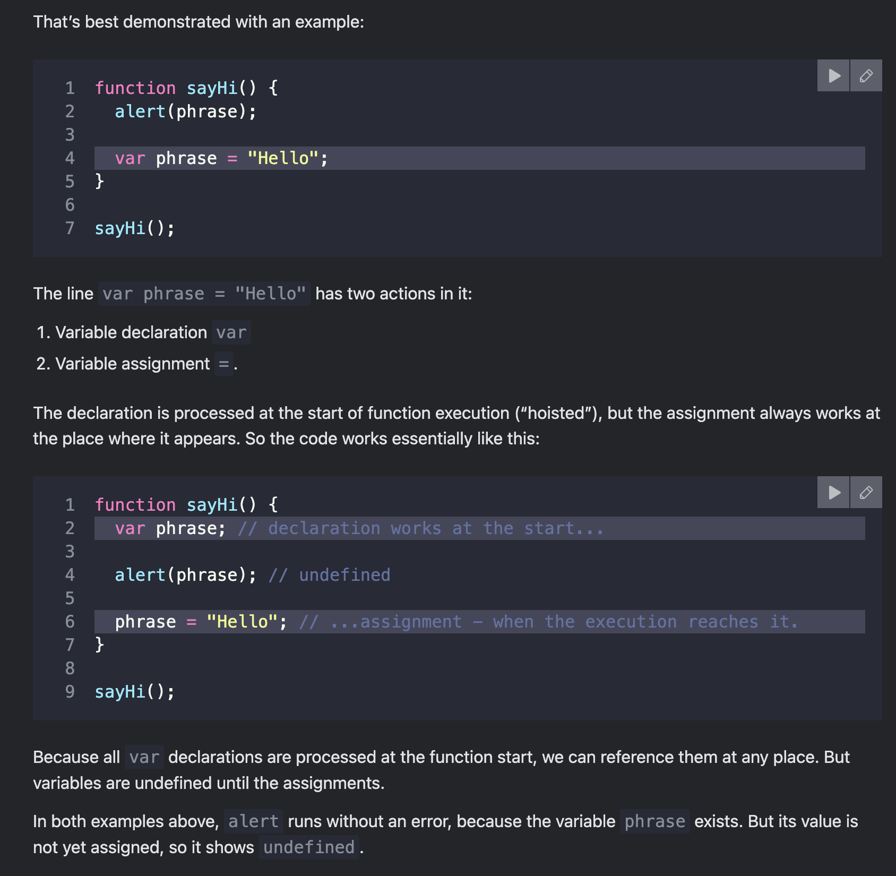

hoisting - 
Declarations are hoisted, but assignments are not.

var - 
https://javascript.info/var#var-has-no-block-scope

var 
- Variables, declared with var, are either function-scoped or global-scoped. 
- They are visible through blocks.
- As var ignores code blocks
- inside a func - func scope 
- can be declared after return statement or after(below) its used 
- allows redeclarations 
- IIFE - 
- var declarations are processed at function start (script start for globals).

For instance:

if (true) {
  var test = true; // use "var" instead of "let"
}

alert(test); // true, the variable lives after if

store funcs 

arrow func - undeined 
function fun1 {} - hoisted - code is stored in memory
source tab breakpoint demo 
call stack demo 