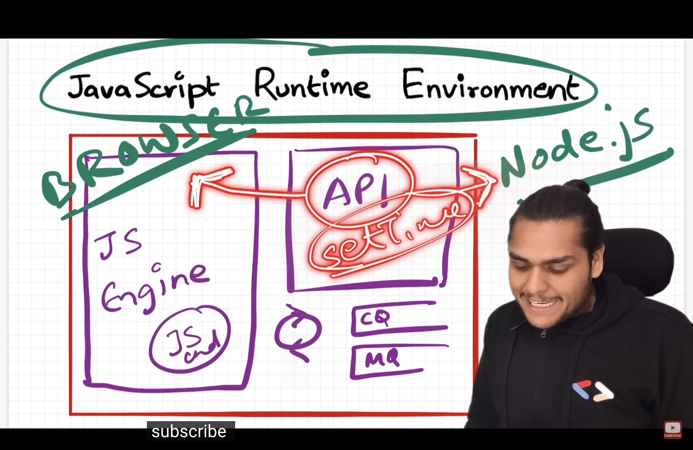
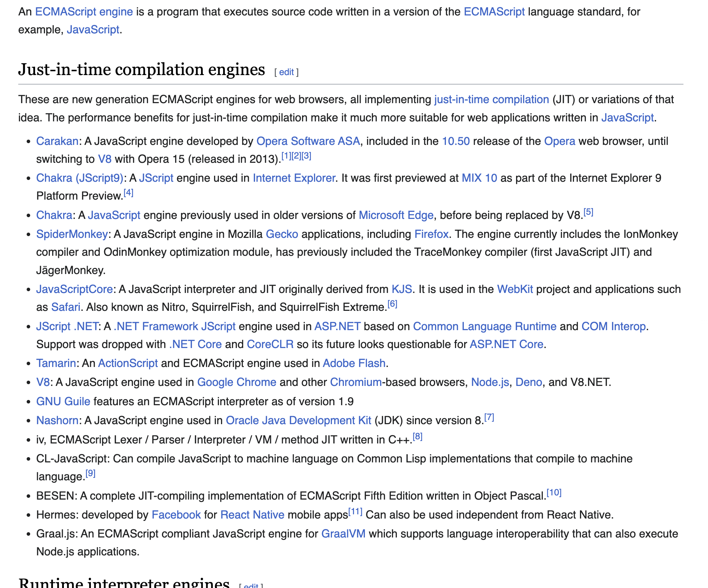
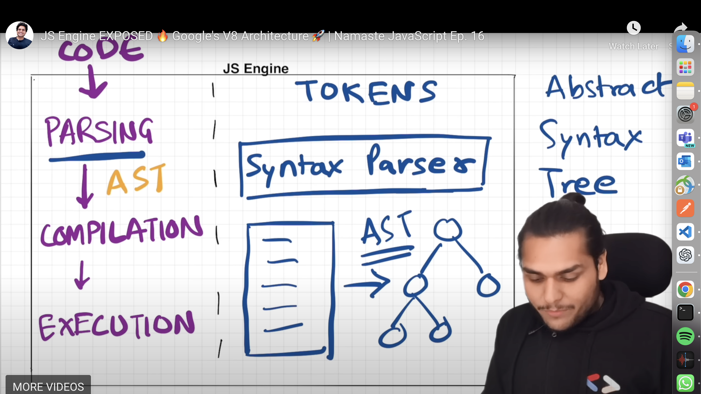
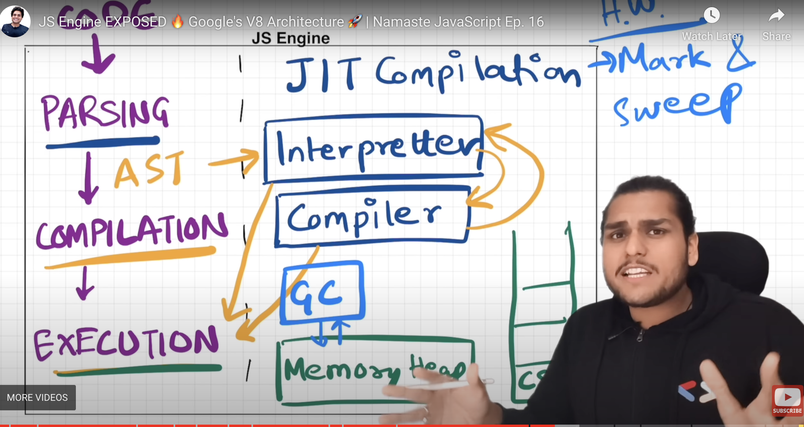
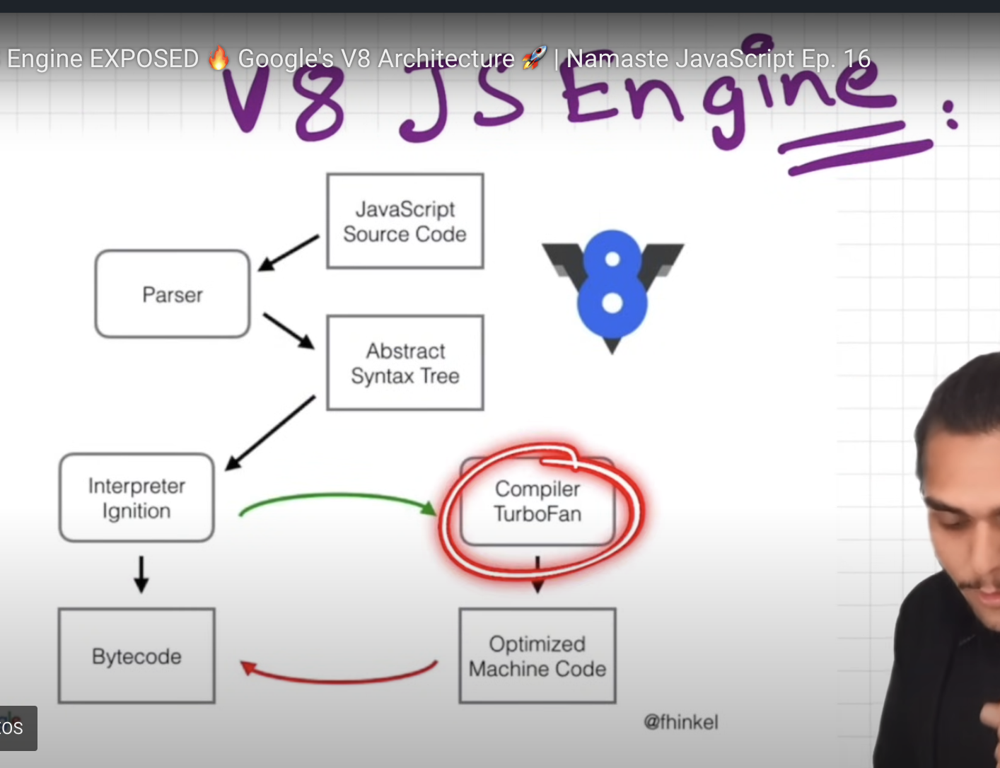

javasript can run inside anything - browser , node , mobile , watch , server , iot , robot etc

Javascript Runtime environment -
- container that has everything which is needed to run javascript code
- js engine (( call stack , memory heap , etc ) ), callback queue , microtask queue , web apis to connect to outer env , event loop ,

JS engine - heart of the runtime environment -

all u need to run js code is a js runtime environment  -

every browser has its own js runtime env

nodejs - opensource javascript runtime evnironment 

Node.js® is a free, open-source, cross-platform JavaScript runtime environment that lets developers create servers, web apps, command line tools and scripts.

apis - 

local storage  - api - present in runtime environment of browser - allows js to access storage of device  

console.log , setTimeout , fetch  etc - api present in runtime environmwnt of both browser and nodejs with same name  - implementation is different in different environments

JS engine -

V8 engine - created by google - open source - present in chrome browser - nodejs - deno -

Chakra - created by microsoft - present in edge browser

Spidermonkey - created by mozilla - present in firefox browser

we can write our own js engine - but u need to follow ECMAScript standards - 

first js engine was created by brendan eich - spidermonkey - for netscape navigator browser

JS engine -

not a machine 

is A PROGRAM - that is written in low level languages

for ex - v8 engine is written in c++

which takes in js code( high level language code) and converts it into machine code which can be executed by the computer

------------------------------------------------------------

JS engine - internals 

JS engine - takes source code - converst it into machine code - executes it - in 3 stages 

-parsing -  Syntax parser   takes the source code -breaks down into tokens -  converts it into AST  
        - abstract syntax tree - which is a tree like structure - which represents the code in a way that the computer can understand

-compilation - 

-execution -

JS engine - call stack , memory heap 

interpreter - reads the code line by line and executes it
compiler - reads the code and converts it into optimised code and executes it

JIT 
AOT 

Garbage collector
 - orinoco - v8 engine - 

memory heap 
call stack 
garbage collector 

all engines have diff implemnetaation of all above compiler , interpretor , paser , garbage collector , and all the above  , but the basic idea is same
