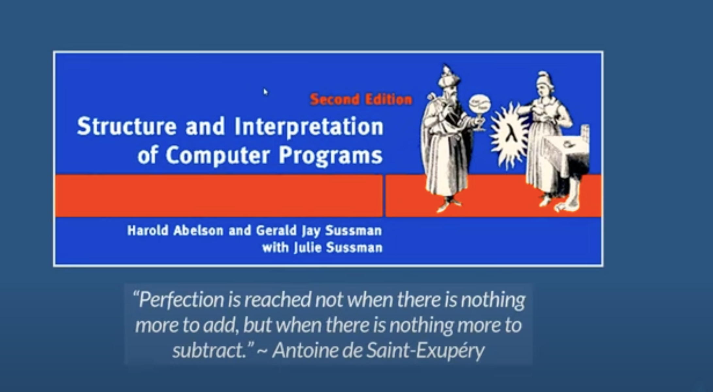
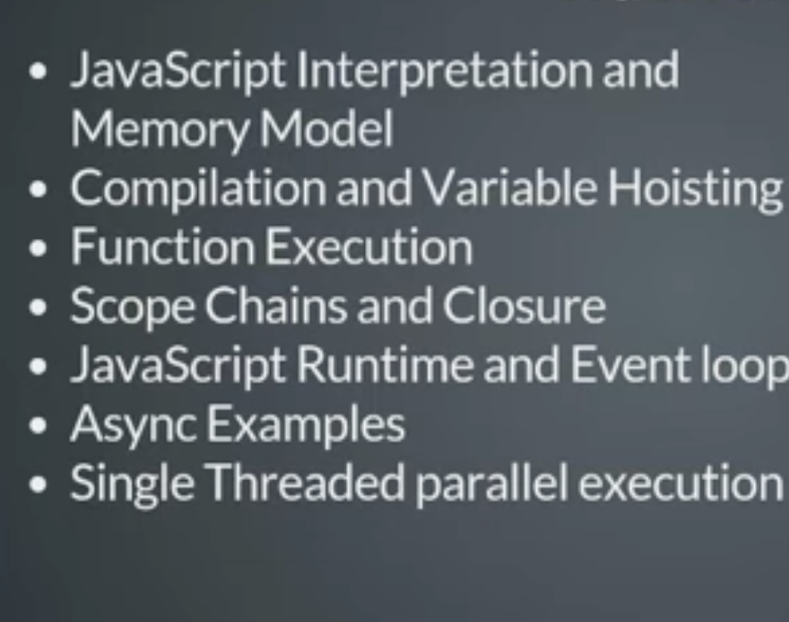
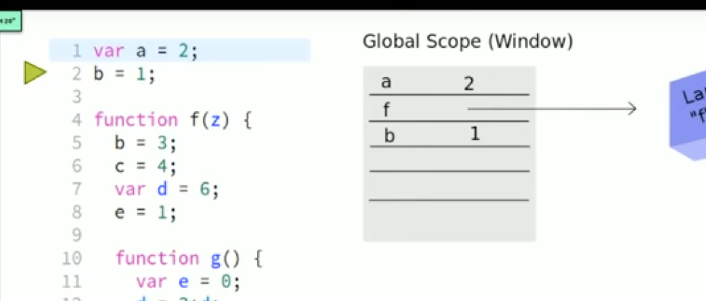

javascript - 2 pass system 
has compilation and execition phase 

compilation phase - goes through declarations 

for vars - 
creates memory for those declarations in global scope 
value dpesnt matter 

for functions - creates a string blob of all content and stores the ref to it , doesnt see whats inside it 

DO"UBTS

stack in jjava - has everything - local vars , return add , 

stack - maintains vv less info - return address and ref to local exec context (mem allocated in heap)

once u go to function - local exec phase 

it goes to compilation phase again 

even if code after return  doesnt run 
it creates a var - 