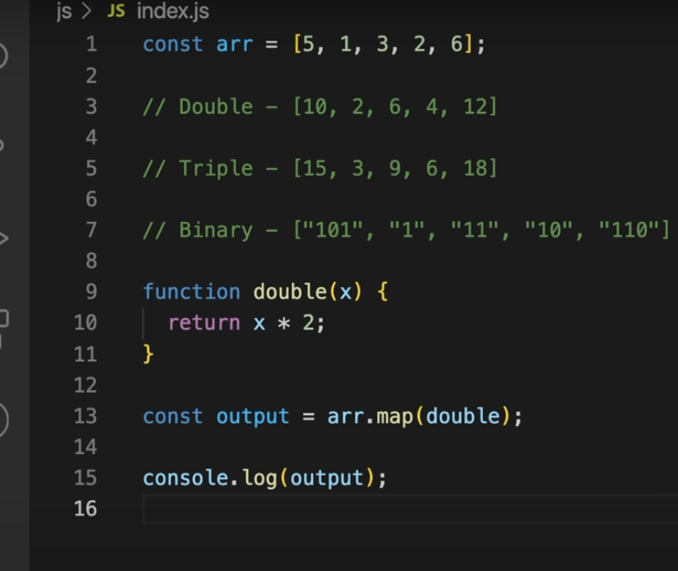
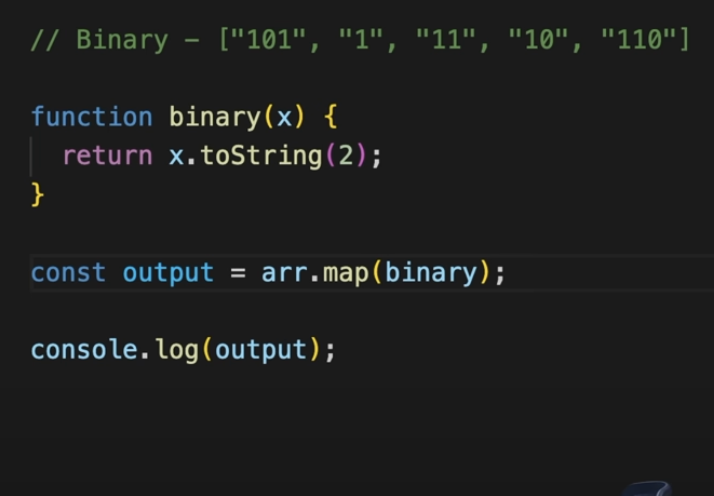
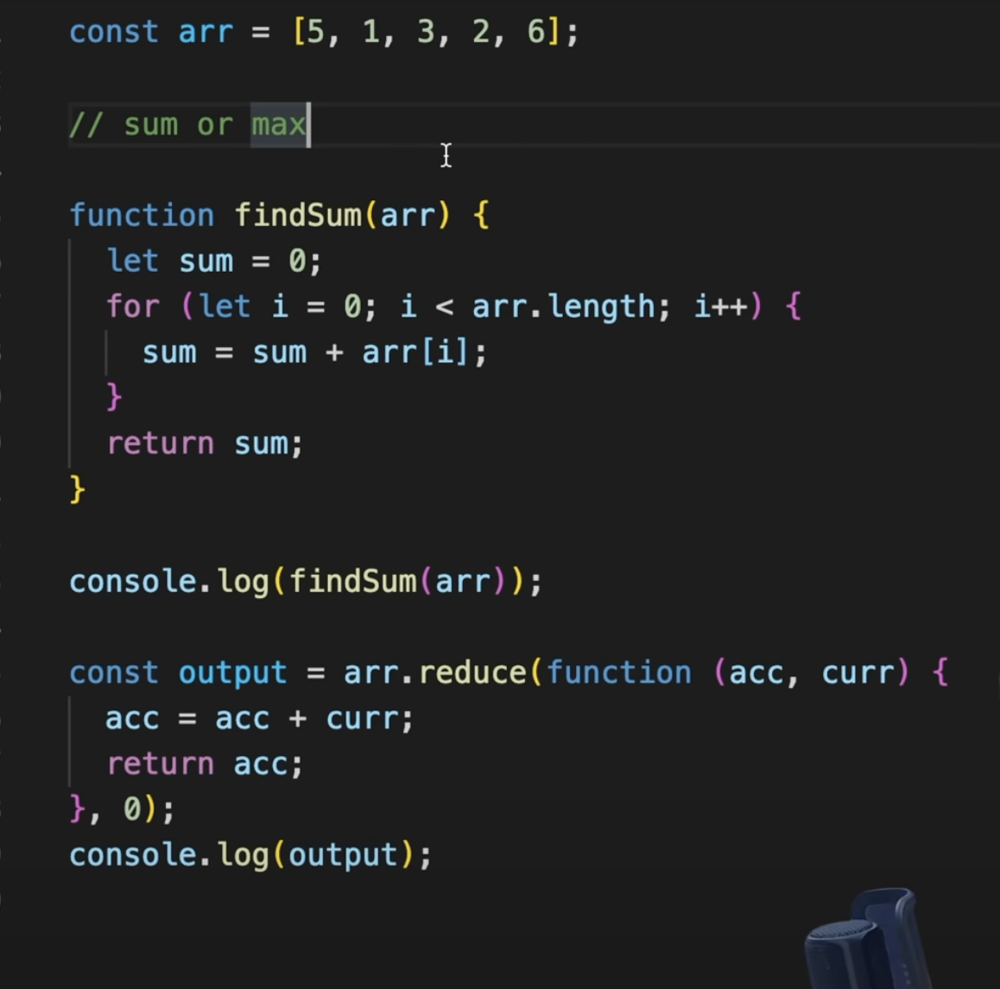
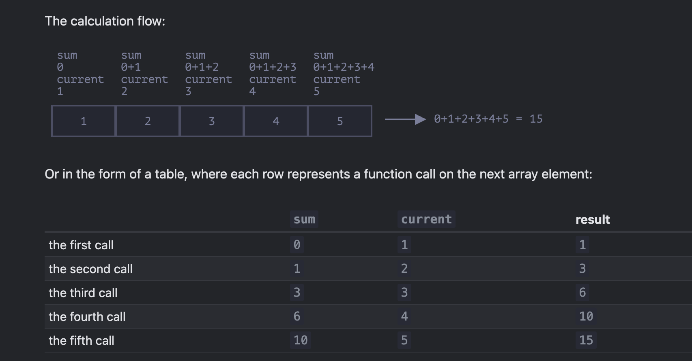

map -
tranformation / transform any array into another array
runs the cb function on every eleemtn of array and  create new arr , return new arr
double , trible , binary 

binary logic : 

whyyy?
Inside the function, x.toString(2) is called. This converts the binary number x into a decimal string. The 2 argument specifies that the conversion should be from base 2 (binary) to base 10 (decimal)

how does .map() work? Basically is takes 2 arguments, a callback and an optional context (will be considered as this in the callback) which I did not use in the previous example. The callback runs for each value in the array and returns each new value in the resulting array.

Keep in mind that the resulting array will always be the same length as the original array.

filter - Basically, if the callback function returns true, the current element will be in the resulting array. If it returns false, it won't be

reduce - 

reduce value to one . 
sum of all elements , product of all elements , max of all elements , min of all elements

articles read: https://www.freedium.cfd/https://medium.com/poka-techblog/simplify-your-javascript-use-map-reduce-and-filter-bd02c593cc2d

OPEN QUESTIONS FOR NEXT ITERATION : 

FUNCTIONAL PROGRAMMING ???
index – is its position.
array – is the array. WHY IS IT USED  ???

NEXT READING :
https://javascript.info/array-methods